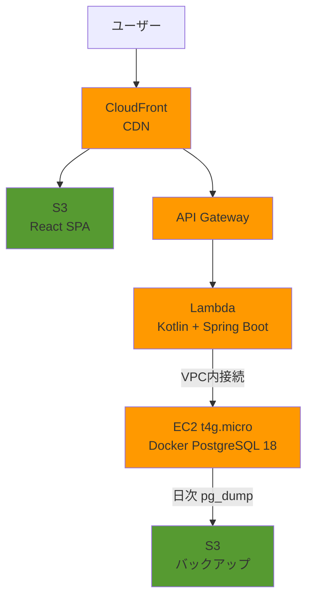
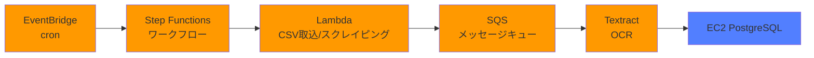
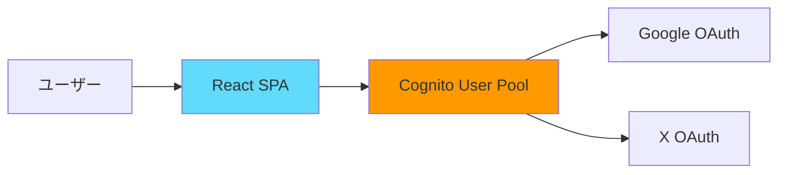

# Personal Data Hub - システムアーキテクチャ

> 最終更新: 2025-10-19

## 概要

個人の生活データ（健康データ、カラオケ採点など）を一元管理するデータハブ。
様々なデータソースから情報を取り込み、可視化・分析するWebアプリケーション。

## システム構成図

### メインアーキテクチャ

**凡例**
- 🟧 オレンジ (#FF9900): AWS サービス
- 🟩 緑 (#569A31): S3 ストレージ
- 🟦 青 (#527FFF): データベース
- 🔷 水色 (#61DAFB): React フロントエンド

### 定期実行フロー

**凡例**
- 🟧 オレンジ (#FF9900): AWS サービス
- 🟦 青 (#527FFF): データベース

### 認証フロー (Phase 3)

**凡例**
- 🟧 オレンジ (#FF9900): AWS サービス
- 🔷 水色 (#61DAFB): React フロントエンド

## プロジェクト構成

詳細は [ディレクトリ構成](directory-structure.md) を参照してください。

## 技術スタック

### フロントエンド
- **言語**: TypeScript
- **フレームワーク**: React
- **ビルド**: Vite
- **ルーティング**: React Router
- **状態管理**: Zustand / Context API
- **テスト（単体）**: Vitest + React Testing Library
- **テスト（E2E）**: Playwright（Phase 3以降）
- **リンター**: ESLint + Prettier
- **ホスティング**: S3 + CloudFront

### バックエンド
- **言語**: Kotlin
- **フレームワーク**: Spring Boot Web + AWS Serverless Java Container
- **SQLマッパー**: Doma
- **テスト**: Spock (Groovy) + Testcontainers (統合テスト)
- **ビルド**: Gradle
- **実行環境**: AWS Lambda + API Gateway

### データベース
- **種類**: PostgreSQL 18
- **実行環境**: EC2 t4g.micro + Docker Compose
- **バックアップ**: pg_dump (日次) + EBS Snapshot (週次)

### インフラ (AWS)
- **コンピュート**: Lambda (Kotlin + Spring Boot), EC2 (Database)
- **API**: API Gateway
- **データベース**: EC2 t4g.micro + Docker PostgreSQL
- **ストレージ**: S3
- **CDN**: CloudFront
- **認証**: Cognito (Google, X OAuth) - Phase 3で実装
- **画像解析**: Textract / Rekognition
- **定期実行**: EventBridge + Step Functions
- **メッセージキュー**: SQS

### IaC (Infrastructure as Code)
- **プロビジョニング**: Pulumi (TypeScript)
- **構成管理**: Ansible
- **バージョン管理**: Git
- **状態管理**: Pulumi S3 Backend

## データベース設計

### 選定理由（ADR 003参照）

**EC2 + Docker PostgreSQL を選択**

- **学習優先度**: RDS学習は低優先（Step Functions, Lambda, SQS, CloudFront, Cognito優先）
- **コスト**: 月$15 → $0-5（無料枠活用）
- **利用状況**: 1人利用、ダウンタイム許容
- **運用**: IaC体制が整っている（Pulumi + Ansible）

### バックアップ戦略

| 種類 | 頻度 | 保存先 | 保持期間 | RPO | RTO |
|------|------|--------|---------|-----|-----|
| pg_dump | 日次 (深夜3時) | S3 | 30日 | 24時間 | 1時間 |
| EBS Snapshot | 週次 (日曜3時) | EBS | 4世代 | 7日 | 30分 |

### セキュリティ
- SecurityGroup: Lambda用SGからのみ5432ポート許可
- パスワード: AWS Secrets Managerで管理
- バックアップS3: サーバーサイド暗号化（SSE-S3）

## 環境構成

| 環境 | 用途 | EC2スペック | Lambda | データベース |
|------|------|------------|--------|-------------|
| **dev** | 開発・テスト | t4g.micro (無料枠) | 開発版 | PostgreSQL (Docker) |
| **prod** | 本番 | t4g.micro | 本番版 | PostgreSQL (Docker) |

## 参考資料

- [ディレクトリ構成](directory-structure.md)
- [開発ロードマップ](plans/roadmap.md)
- [実装ノート](plans/implementation-notes.md)
- [次のアクション](plans/next-actions.md)
- [ADR (Architecture Decision Records)](adr/)

### 外部リンク
- [AWS Lambda with Kotlin](https://docs.aws.amazon.com/lambda/latest/dg/lambda-kotlin.html)
- [Spring Boot on AWS Lambda](https://spring.io/guides/gs/serverless/)
- [Doma 2 Documentation](https://doma.readthedocs.io/)
- [PostgreSQL Docker Hub](https://hub.docker.com/_/postgres)
