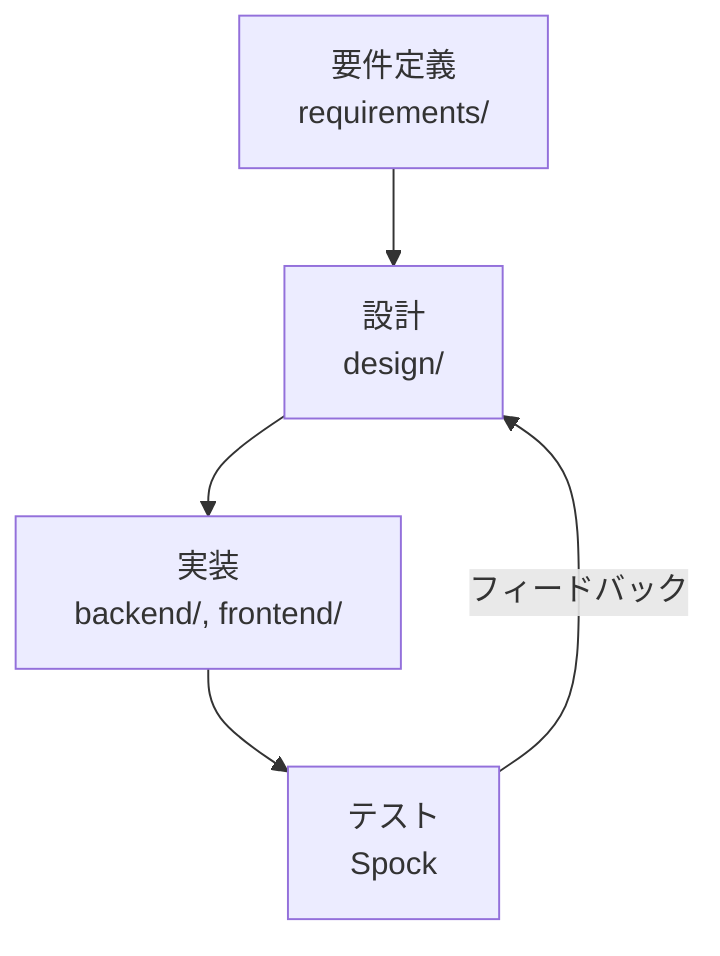

# Personal Data Hub - 開発ワークフロー

> 最終更新: 2025-10-19

## 概要

このドキュメントでは、要件定義から実装・テストまでの開発フローを定義します。

## 開発フロー



## 1. 要件定義 (requirements/)

### 目的
何を作るか（WHAT）を明確にする。

### 成果物
- **業務フロー図**: Mermaid/PlantUMLで全体の流れを可視化
- **ユースケース記述**: 機能ごとの詳細要件

### ファイル構成（案）
```
requirements/
├── overview.md                    # 全体概要・業務フロー
├── uc-001-blood-pressure-import.md    # ユースケース001
├── uc-002-body-composition-import.md  # ユースケース002
└── ...
```

### ユースケース記述テンプレート
テンプレートは [templates/requirements/usecase-template.md](templates/requirements/usecase-template.md) を参照してください。

## 2. 設計 (design/)

### 目的
どう作るか（HOW）を定義する。

### 成果物
- **API仕様**: エンドポイント、リクエスト/レスポンス
- **振る舞い仕様**: Given-When-Then形式（Spockテストの元ネタ）
- **フロントエンド仕様**: 画面設計、状態管理

### ファイル構成（案）
```
design/
├── usecase-index.md              # ユースケース一覧（インデックス）
├── database/                     # DB設計（共通）
│   ├── schema.md                # スキーマ全体
│   └── er-diagram.md            # ER図
├── api/                          # API系ユースケース
│   ├── uc-001-csv-upload/
│   │   ├── api-spec.md
│   │   ├── behavior-spec.md
│   │   └── frontend-spec.md
│   └── uc-002-data-list/
│       ├── api-spec.md
│       ├── behavior-spec.md
│       └── frontend-spec.md
├── batch/                        # バッチ系ユースケース
│   └── uc-010-daily-backup/
│       ├── batch-spec.md
│       └── behavior-spec.md
├── workflow/                     # ワークフロー系ユースケース
│   └── uc-020-ocr-flow/
│       ├── workflow-spec.md
│       └── behavior-spec.md
└── webhook/                      # Webhook系ユースケース
    └── uc-030-receiver/
        ├── api-spec.md
        └── behavior-spec.md
```

### ユースケース種別と必要ファイル

| 種別 | ディレクトリ | 必要ファイル |
|------|------------|-------------|
| API (画面あり) | `api/` | `api-spec.md`, `behavior-spec.md`, `frontend-spec.md` |
| API (画面なし) | `api/` | `api-spec.md`, `behavior-spec.md` |
| Batch (定期実行) | `batch/` | `batch-spec.md`, `behavior-spec.md` |
| Workflow (Step Functions) | `workflow/` | `workflow-spec.md`, `behavior-spec.md` |
| Webhook | `webhook/` | `api-spec.md`, `behavior-spec.md` |

**共通ルール:**
- すべてのユースケースで `behavior-spec.md` は必須（テストのため）
- 必要なファイルだけを配置（柔軟な構成）
- `usecase-index.md` でUC番号順・種別ごとの一覧を管理

### 設計仕様テンプレート

各ユースケース種別に応じたテンプレートを使用してください：

- **API仕様**: [templates/design/api-spec-template.md](templates/design/api-spec-template.md)
- **振る舞い仕様** (Spock用): [templates/design/behavior-spec-template.md](templates/design/behavior-spec-template.md)
- **フロントエンド仕様**: [templates/design/frontend-spec-template.md](templates/design/frontend-spec-template.md)
- **バッチ仕様**: [templates/design/batch-spec-template.md](templates/design/batch-spec-template.md)
- **ワークフロー仕様**: [templates/design/workflow-spec-template.md](templates/design/workflow-spec-template.md)
- **ユースケースインデックス**: [templates/design/usecase-index-template.md](templates/design/usecase-index-template.md)

## 3. 実装 (backend/, frontend/)

### バックエンド (Kotlin + Spring Boot)
- `design/uc-xxx/api-spec.md` に基づいてAPI実装
- `design/uc-xxx/behavior-spec.md` に基づいてSpockテスト実装

### フロントエンド (React + TypeScript)
- `design/uc-xxx/frontend-spec.md` に基づいてコンポーネント実装
- ストーリーブック等で確認

## 4. テスト

### バックエンドテスト (Spock)
- `behavior-spec.md` の Given-When-Then を Spock テストコードに変換
- 振る舞い仕様とテストコードが1対1対応

### フロントエンドテスト
- Jest/React Testing Library
- E2Eテスト（必要に応じて）

## ドキュメント更新ルール

### 要件変更時
1. `requirements/uc-xxx.md` を更新
2. 影響を受ける `design/uc-xxx/` 配下を更新
3. 実装・テストを修正

### 設計変更時
1. `design/uc-xxx/` 配下を更新
2. 実装・テストを修正

## 参考資料

- [システムアーキテクチャ](architecture.md)
- [ディレクトリ構成](directory-structure.md)
- [開発ロードマップ](plans/roadmap.md)
