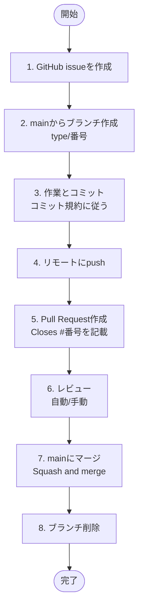

# Gitワークフロー

このドキュメントは、Personal Data Hubプロジェクトにおけるブランチ戦略とPRワークフローを定義します。

## 目的

- issueベースの開発フローを確立
- ブランチ命名規則を統一
- PRレビュープロセスを明確化
- コミット規約との一貫性を保つ

## ブランチ戦略

### メインブランチ

- **`main`**: 本番環境にデプロイ可能な安定版
  - 直接コミット禁止（緊急時を除く）
  - PRマージによってのみ更新

### 作業ブランチ

作業ブランチは以下の命名規則に従います：

```
<type>/<issue番号>[-<optional-description>]
```

#### type の種類（8種類）

| Type | 説明 | コミットメッセージ例 |
|------|------|---------------------|
| `feature` | 新機能の追加 | ✨ feature: 体重データ登録APIを追加 |
| `fix` | バグ修正 | 🐛 fix: データ保存時のnullエラーを修正 |
| `docs` | ドキュメントのみの変更 | 📝 docs: アーキテクチャ図を更新 |
| `style` | スタイル・フォーマットの変更 | 💄 style: Kotlinコードをフォーマット |
| `refactor` | リファクタリング | ♻️ refactor: データ取得処理を共通化 |
| `test` | テストの追加・修正 | ✅ test: APIテストを追加 |
| `chore` | ビルド、設定変更 | 🔧 chore: Gradle依存関係を更新 |
| `perf` | パフォーマンス改善 | ⚡ perf: データベースクエリを最適化 |

#### ブランチ名の例

```bash
# シンプルな形式（推奨）
feature/1
fix/5
docs/2

# 説明付き形式（任意）
feature/1-github-mcp-setup
fix/5-null-pointer
docs/2-workflow
```

**descriptionの有無はどちらでもOK**。issue番号があれば内容は参照できるため、シンプルな形式で問題ありません。

### コミット規約との統一

ブランチの`type`とコミットメッセージの`type`は完全に一致させます。

**ブランチ**: `feature/1`
**コミット**: `✨ feature: GitHub MCP設定ドキュメントを追加`

詳細は [commit-convention.md](commit-convention.md) を参照してください。

## issueベースの開発フロー

### 全体の流れ



### 1. issueの作成

GitHub issueで作業内容を定義します。

```markdown
## 概要
何を実現するか

## 背景
なぜ必要か

## タスク
- [ ] 実施すること1
- [ ] 実施すること2

## 完了条件
- [ ] 〇〇が完了している
```

### 2. ブランチの作成

mainブランチから作業ブランチを作成します。

```bash
# mainブランチを最新化
git checkout main
git pull origin main

# 作業ブランチを作成（issue番号に対応）
git checkout -b feature/1

# または説明付き
git checkout -b feature/1-github-mcp-setup
```

### 3. 作業とコミット

コミット規約に従って作業を進めます。

```bash
# 変更を確認
git status
git diff

# ステージング
git add <files>

# コミット（コミット規約に従う）
git commit -m "$(cat <<'EOF'
✨ feature: GitHub MCP設定ドキュメントを追加

Personal Access Tokenの発行手順、必要な権限、
セキュリティに関する注意事項を記載。

Closes #1

🤖 Generated with [Claude Code](https://claude.com/claude-code)

Co-Authored-By: Claude <noreply@anthropic.com>
EOF
)"
```

**ポイント**:
- コミットメッセージに `Closes #1` を含めると、PRマージ時に自動的にissueがクローズされる
- 複数の論理的な変更がある場合は、コミットを分割する

### 4. リモートにpush

```bash
# 初回push
git push -u origin feature/1

# 2回目以降
git push
```

### 5. Pull Requestの作成

GitHubでPRを作成します。

#### PRタイトル

コミットメッセージと同じ形式（絵文字 + type）を使用：

```
✨ feature: GitHub MCP設定ドキュメントを追加
```

#### PR description

```markdown
## 概要
このPRは何をするか（1-2行で簡潔に）

## 関連issue
Closes #1

## 変更内容
- 変更点1
- 変更点2

## テスト
- [ ] 手動テスト完了
- [ ] 単体テスト追加/更新
- [ ] 統合テスト追加/更新

## スクリーンショット（該当する場合）
（画像を添付）

🤖 Generated with [Claude Code](https://claude.com/claude-code)
```

### 6. レビュー

**個人プロジェクトの場合**:
- 自己レビュー（変更内容を再確認）
- CIが通ることを確認（設定後）

**チーム開発の場合**:
- レビュアーをアサイン
- フィードバックに対応
- Approve後にマージ

### 7. マージ

PRをmainブランチにマージします。

**マージ方法**:
- **Squash and merge**（推奨）: 複数コミットを1つにまとめる
- **Merge commit**: コミット履歴をそのまま保持
- **Rebase and merge**: 線形な履歴を維持

個人プロジェクトでは **Squash and merge** を推奨します。

### 8. ブランチの削除

マージ後、作業ブランチを削除します。

```bash
# ローカルブランチを削除
git checkout main
git branch -d feature/1

# リモートブランチを削除（GitHubで自動削除設定がない場合）
git push origin --delete feature/1
```

## 特別なケース

### 緊急対応（Hotfix）

本番環境で緊急のバグ修正が必要な場合：

```bash
# mainから直接hotfixブランチを作成
git checkout main
git checkout -b fix/999-critical-bug

# 修正後、mainに直接マージ
# PR作成 → レビュー省略可（緊急時） → マージ
```

### 複数issueにまたがる作業

基本的には1ブランチ = 1issueですが、密接に関連する場合は例外的に許容：

```bash
# メインのissue番号を使用
feature/10-user-authentication

# PRのdescriptionで関連issueを明記
Closes #10, #11, #12
```

## AIエージェント向けの指示

### ブランチ作成時

1. issue番号を確認
2. 適切なtypeを選択（feature, fix, docs等）
3. `<type>/<issue番号>` 形式でブランチ作成
4. mainブランチから派生させる

### PR作成時

1. PRタイトルはコミットメッセージと同じ形式
2. `Closes #<issue番号>` を必ず含める
3. 変更内容を簡潔に説明
4. Claude Code フッターを付与

### マージ後

1. ブランチを削除
2. mainブランチに切り替え
3. pullして最新化

## 参考資料

- [コミット規約](commit-convention.md)
- [GitHub Flow](https://docs.github.com/en/get-started/quickstart/github-flow)
- [Closing issues using keywords](https://docs.github.com/en/issues/tracking-your-work-with-issues/linking-a-pull-request-to-an-issue)

## 変更履歴

| 日付 | 変更内容 |
|------|---------|
| 2025-10-19 | 初版作成（ブランチ命名規則、PRワークフロー定義） |
