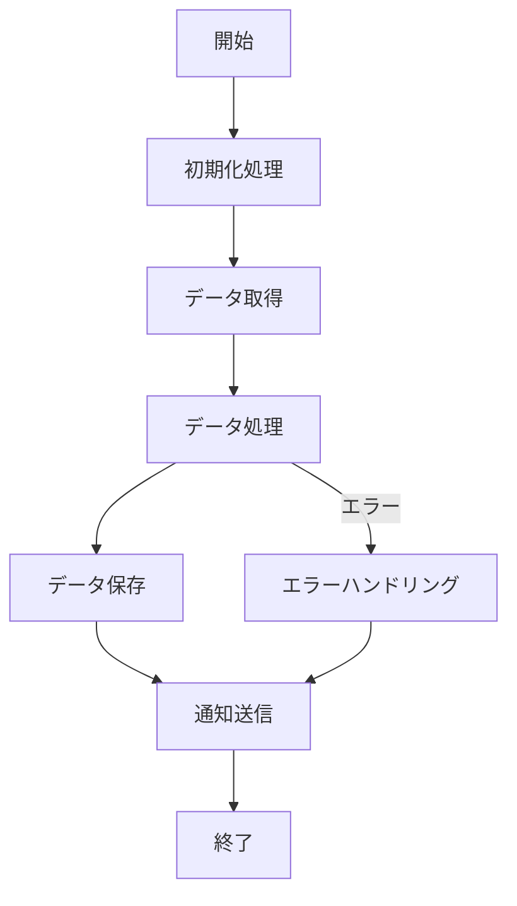

# UC-XXX: [機能名] - バッチ仕様

## 概要
[このバッチ処理の目的と役割を1〜2文で記載]

## 実行環境
- **実行基盤**: Lambda / EC2 / ECS
- **実行トリガー**: EventBridge / 手動実行
- **実行スケジュール**: cron式 `cron(0 3 * * ? *)` (例: 毎日3時)
- **タイムアウト**: 15分

## 処理フロー



## 処理詳細

### 1. 初期化処理
- 環境変数の読み込み
- データベース接続確立
- 処理開始ログ出力

### 2. データ取得
- **取得元**: データベース / S3 / 外部API
- **取得条件**: [条件を記載]
- **取得件数**: 想定XXX件

### 3. データ処理
- **処理内容**: [処理の詳細]
- **処理単位**: 1件ずつ / バッチ100件ずつ
- **並列処理**: あり（最大5並列） / なし

### 4. データ保存
- **保存先**: データベース / S3
- **保存形式**: JSON / CSV / データベースレコード

### 5. 通知送信（オプション）
- **通知先**: SNS / メール / Slack
- **通知条件**: 処理完了時 / エラー発生時

## 入力

### 環境変数
| 変数名 | 説明 | 例 |
|--------|------|-----|
| TARGET_DATE | 処理対象日 | 2025-10-19 |
| BATCH_SIZE | バッチサイズ | 100 |

### 入力データ
- **形式**: CSV / JSON / データベーステーブル
- **場所**: S3バケット / データベース
- **サンプル**:
```json
{
  "data": [
    {"id": 1, "value": "xxx"},
    {"id": 2, "value": "yyy"}
  ]
}
```

## 出力

### 処理結果
- **形式**: JSON / CSV / ログ
- **保存先**: S3 / データベース / CloudWatch Logs
- **サンプル**:
```json
{
  "processedCount": 150,
  "errorCount": 2,
  "startTime": "2025-10-19T03:00:00Z",
  "endTime": "2025-10-19T03:05:30Z"
}
```

### ログ
- **ログレベル**: INFO / WARN / ERROR
- **ログ出力先**: CloudWatch Logs
- **重要なログポイント**:
  - 処理開始/終了
  - 処理件数（100件ごと）
  - エラー発生時

## エラーハンドリング

### リトライ戦略
- **リトライ回数**: 3回
- **リトライ間隔**: 指数バックオフ（1秒、2秒、4秒）
- **リトライ対象**: 一時的なエラー（ネットワークエラーなど）

### エラー時の挙動
| エラー種別 | 対応 |
|-----------|------|
| 個別データエラー | エラーログ出力、スキップして次へ |
| 致命的エラー | 処理中断、アラート送信 |
| タイムアウト | 処理中断、次回実行時に続きから再開 |

### アラート
- **送信条件**: エラー率が10%を超えた場合
- **送信先**: SNS Topic / Slack
- **内容**: エラー件数、エラー内容のサマリ

## モニタリング

### メトリクス
- 処理時間
- 処理件数
- エラー件数
- メモリ使用量

### CloudWatch アラーム
- 処理時間が15分を超えた場合
- エラー率が10%を超えた場合

## テスト

### テストケース
1. **正常系**: 想定通りのデータで処理が完了する
2. **異常系**: 不正なデータでエラーハンドリングが動作する
3. **境界値**: 0件、大量データ（10,000件）
4. **リトライ**: 一時的なエラーでリトライが動作する

### テストデータ
- 正常データ: `test-data/normal.json`
- 異常データ: `test-data/error.json`

## 運用

### 手動実行方法
```bash
# Lambda関数の場合
aws lambda invoke \
  --function-name xxx-batch \
  --payload '{"targetDate": "2025-10-19"}' \
  response.json
```

### ログ確認方法
```bash
# CloudWatch Logs
aws logs tail /aws/lambda/xxx-batch --follow
```

### バッチ停止方法
- Lambda: タイムアウトを待つ
- ECS: `aws ecs stop-task` コマンド

## 備考
[その他の補足情報、制約事項など]
