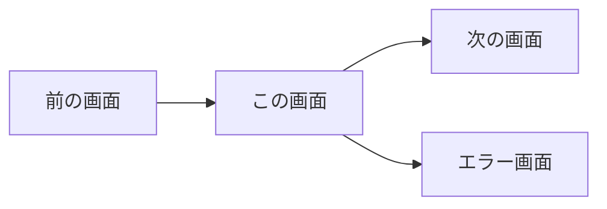

# UC-XXX: [機能名] - フロントエンド仕様

## 画面概要
[この画面の目的と役割を1〜2文で記載]

## 画面遷移図



## 画面レイアウト

```
┌─────────────────────────────────────┐
│ ヘッダー                            │
├─────────────────────────────────────┤
│                                     │
│  [入力フォーム]                     │
│  ┌─────────────────┐                │
│  │ フィールド1     │                │
│  └─────────────────┘                │
│  ┌─────────────────┐                │
│  │ フィールド2     │                │
│  └─────────────────┘                │
│                                     │
│  [送信ボタン]  [キャンセルボタン]   │
│                                     │
├─────────────────────────────────────┤
│ フッター                            │
└─────────────────────────────────────┘
```

## コンポーネント構成

### コンポーネントツリー
```
XxxPage
├── XxxForm
│   ├── InputField (field1)
│   ├── InputField (field2)
│   └── SubmitButton
└── ErrorMessage (条件付き表示)
```

### 主要コンポーネント

#### XxxForm
- **役割**: フォーム全体の管理
- **Props**:
  - `onSubmit: (data) => void` - 送信時のハンドラ
  - `initialValues?: object` - 初期値（編集時）
- **State**:
  - `formData: object` - フォームデータ
  - `errors: object` - バリデーションエラー

#### InputField
- **役割**: 入力フィールドの共通コンポーネント
- **Props**:
  - `name: string` - フィールド名
  - `label: string` - ラベル
  - `value: string` - 値
  - `onChange: (value) => void` - 変更ハンドラ
  - `error?: string` - エラーメッセージ

## 状態管理

### ローカルState
```typescript
interface XxxState {
  formData: {
    field1: string;
    field2: number;
  };
  isLoading: boolean;
  error: string | null;
}
```

### グローバルState（必要な場合）
- Redux/Zustand/Context API を使用
- どのデータをグローバルで持つか記載

## バリデーションルール

| フィールド | ルール |
|-----------|--------|
| field1 | 必須、最大50文字 |
| field2 | 必須、0以上の整数 |

## API連携

### 使用API
- `POST /api/v1/xxx` - データ送信

### APIコール処理
1. フォーム送信
2. ローディング表示開始
3. API呼び出し
4. 成功時: 次の画面へ遷移
5. 失敗時: エラーメッセージ表示

## インタラクション

### ユーザー操作
| 操作 | 挙動 |
|------|------|
| 入力フィールドにフォーカス | 枠線のハイライト |
| 入力値変更 | リアルタイムバリデーション |
| 送信ボタンクリック | バリデーション後、API呼び出し |
| キャンセルボタンクリック | 前の画面に戻る |

### エラーハンドリング
- バリデーションエラー: フィールド下に赤文字で表示
- API エラー: 画面上部に通知バナー表示

## スタイリング

### デザイントークン
- 色: `primary`, `error`, `background`
- サイズ: `spacing-sm`, `spacing-md`, `spacing-lg`
- フォント: `font-body`, `font-heading`

### レスポンシブ対応
- モバイル (〜768px): 1カラム
- タブレット (769px〜1024px): 2カラム
- デスクトップ (1025px〜): 2カラム

## アクセシビリティ
- すべての入力フィールドに `label` 要素を使用
- エラーメッセージは `aria-describedby` で関連付け
- キーボード操作可能

## 備考
[その他の補足情報]
