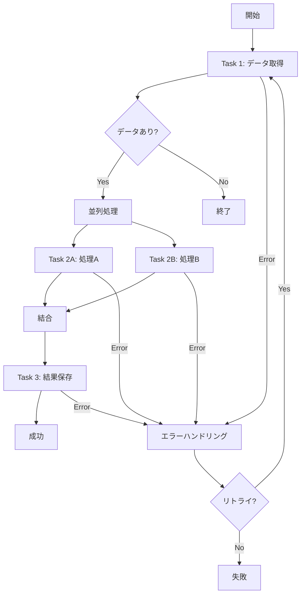

# UC-XXX: [機能名] - ワークフロー仕様

## 概要
[このワークフローの目的と役割を1〜2文で記載]

## 実行環境
- **実行基盤**: AWS Step Functions
- **実行トリガー**: EventBridge / API Gateway / Lambda
- **実行スケジュール**: cron式 `cron(0 3 * * ? *)` (定期実行の場合)
- **タイムアウト**: 1時間

## ワークフロー図



## Step Functions 定義

### State Machine ARN
`arn:aws:states:ap-northeast-1:123456789012:stateMachine:xxx-workflow`

### States 詳細

#### 1. Task 1: データ取得
- **Type**: Task
- **Resource**: Lambda ARN `xxx-fetch-lambda`
- **Input**:
```json
{
  "targetDate": "2025-10-19"
}
```
- **Output**:
```json
{
  "data": [...]
}
```
- **Retry**:
  - ErrorEquals: `["States.TaskFailed"]`
  - IntervalSeconds: 2
  - MaxAttempts: 3
  - BackoffRate: 2.0
- **Catch**:
  - ErrorEquals: `["States.ALL"]`
  - Next: ErrorHandler

#### 2. Choice: データあり?
- **Type**: Choice
- **Choices**:
  - Variable: `$.data`
  - IsPresent: true
  - Next: Parallel
- **Default**: End

#### 3. Parallel: 並列処理
- **Type**: Parallel
- **Branches**:
  - Branch 1: Task 2A
  - Branch 2: Task 2B
- **Next**: Task 3

#### 4. Task 2A: 処理A
- **Type**: Task
- **Resource**: Lambda ARN `xxx-process-a-lambda`
- **TimeoutSeconds**: 300

#### 5. Task 2B: 処理B
- **Type**: Task
- **Resource**: Lambda ARN `xxx-process-b-lambda`
- **TimeoutSeconds**: 300

#### 6. Task 3: 結果保存
- **Type**: Task
- **Resource**: Lambda ARN `xxx-save-lambda`
- **End**: true

#### 7. ErrorHandler: エラーハンドリング
- **Type**: Task
- **Resource**: Lambda ARN `xxx-error-handler-lambda`
- **Next**: Fail

## 使用するLambda関数

### xxx-fetch-lambda
- **役割**: データ取得
- **ランタイム**: Kotlin + Spring Boot
- **タイムアウト**: 60秒
- **メモリ**: 512MB

### xxx-process-a-lambda
- **役割**: 処理A（OCR実行など）
- **ランタイム**: Kotlin + Spring Boot
- **タイムアウト**: 300秒
- **メモリ**: 1024MB

### xxx-process-b-lambda
- **役割**: 処理B（データ変換など）
- **ランタイム**: Kotlin + Spring Boot
- **タイムアウト**: 300秒
- **メモリ**: 512MB

### xxx-save-lambda
- **役割**: 結果保存
- **ランタイム**: Kotlin + Spring Boot
- **タイムアウト**: 60秒
- **メモリ**: 512MB

### xxx-error-handler-lambda
- **役割**: エラー通知
- **ランタイム**: Kotlin + Spring Boot
- **タイムアウト**: 30秒
- **メモリ**: 256MB

## 連携サービス

### SQS（使用する場合）
- **Queue名**: xxx-processing-queue
- **用途**: Lambda間のメッセージング
- **Visibility Timeout**: 300秒

### SNS（使用する場合）
- **Topic名**: xxx-notification-topic
- **用途**: エラー通知

## エラーハンドリング

### リトライ戦略
- **リトライ回数**: 3回
- **リトライ間隔**: 指数バックオフ（2秒、4秒、8秒）
- **リトライ対象**: 一時的なエラー

### エラー時の挙動
| エラー種別 | 対応 |
|-----------|------|
| Lambda タイムアウト | 3回リトライ後、エラーハンドラへ |
| Lambda 実行エラー | 3回リトライ後、エラーハンドラへ |
| Choice で想定外の状態 | 正常終了（データなし） |

### アラート
- **送信条件**: ワークフロー失敗時
- **送信先**: SNS Topic
- **内容**: エラー内容、実行ID

## モニタリング

### CloudWatch メトリクス
- 実行回数
- 成功/失敗回数
- 実行時間
- 各ステップの実行時間

### X-Ray トレーシング
- 有効化: Yes
- トレース対象: すべてのLambda関数

## テスト

### テストケース
1. **正常系**: すべてのステップが成功
2. **並列処理**: 2つの処理が並列実行される
3. **データなし**: Choice でデータなしの分岐
4. **リトライ**: 一時的エラーでリトライ成功
5. **エラー**: 永続的エラーでエラーハンドラ実行

### テストデータ
```json
{
  "targetDate": "2025-10-19",
  "testMode": true
}
```

## 運用

### 手動実行方法
```bash
aws stepfunctions start-execution \
  --state-machine-arn arn:aws:states:ap-northeast-1:123456789012:stateMachine:xxx-workflow \
  --input '{"targetDate": "2025-10-19"}'
```

### 実行履歴確認
```bash
aws stepfunctions list-executions \
  --state-machine-arn arn:aws:states:ap-northeast-1:123456789012:stateMachine:xxx-workflow
```

### 実行停止方法
```bash
aws stepfunctions stop-execution \
  --execution-arn arn:aws:states:ap-northeast-1:123456789012:execution:xxx-workflow:execution-id
```

## コスト試算
- Step Functions: 実行回数 × $0.025/1000回
- Lambda: 各関数の実行時間 × メモリ × 料金
- 月間想定実行回数: XXX回
- 月間想定コスト: $XX

## 備考
[その他の補足情報、制約事項など]
