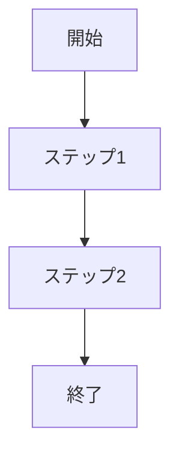

# UC-XXX: [機能名]

## 概要
[この機能の説明を1〜2文で記載]

## アクター
- ユーザー
- [その他のアクター]

## 前提条件
- [前提となる状態や条件]

## 業務フロー

## 入力
- **項目名**: 説明
- **項目名**: 説明

## 出力
- **項目名**: 説明
- **項目名**: 説明

## 例外処理
- **エラーケース1**: 対応方法
- **エラーケース2**: 対応方法

## 備考
[その他の補足情報]
